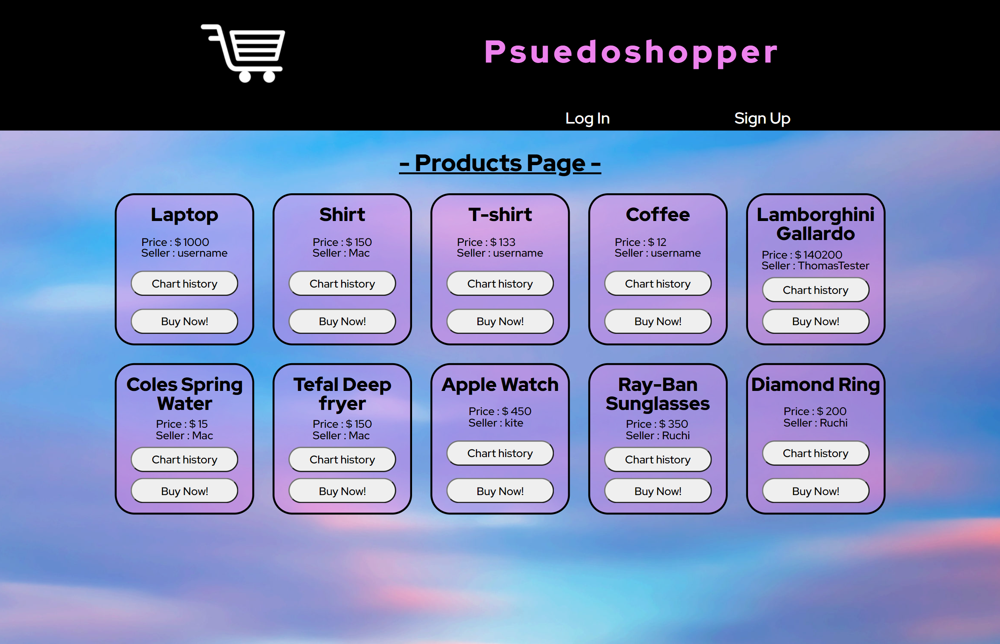
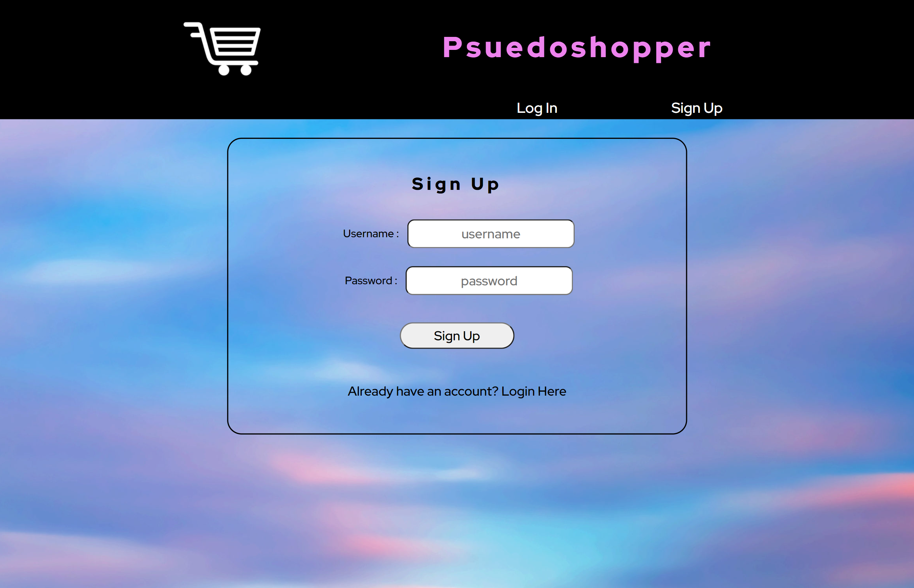
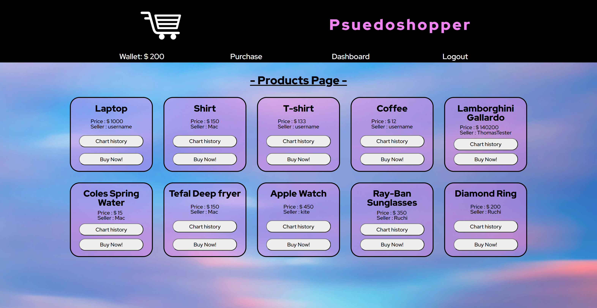
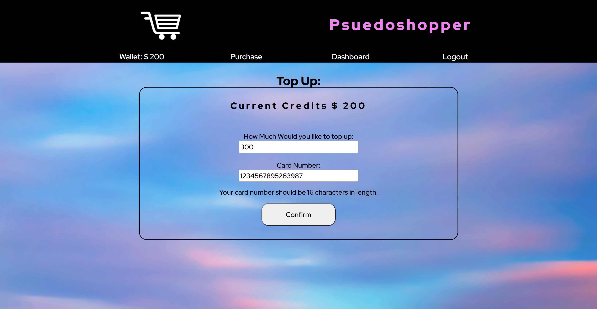
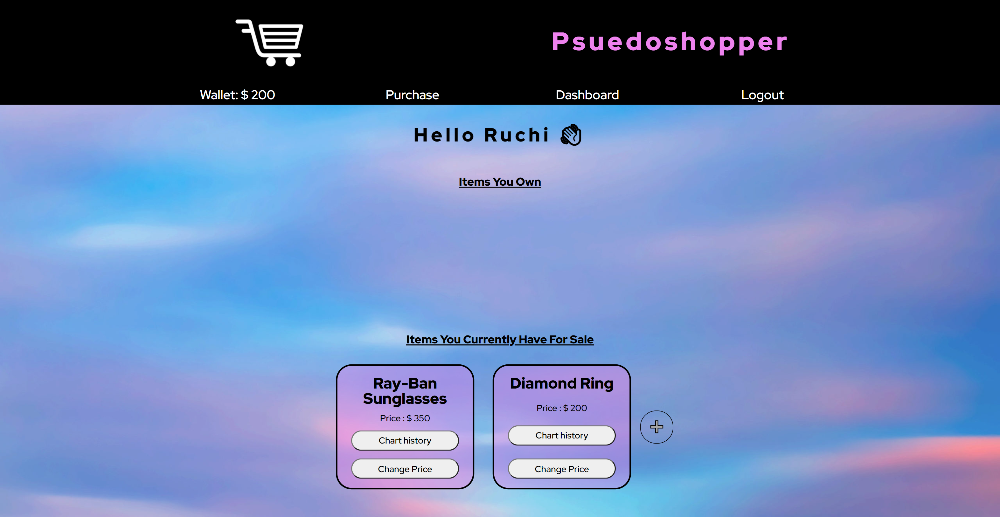

# E-commerce Website: Psuedoshopper

## Description 

Build a CMS-style E-commerce site, where developers can buy and sell the goods online. The site is built from scratch and deployed to Heroku. It follows the MVC paradigm in its architectural structure, using Handlebars.js as the templating language, Sequelize as the ORM, and the express-session npm package for authentication.

## Table of Contents
- [Description](#description)
- [Requirements](#requirements)
- [Technologies](#technologies)
- [Installation-Usage](#installation-usage)
- [Links](#links)
- [Screenshots](#screenshots)

## Requirements

1. When a user visits the site for the first time, they are presented with the Products Page, which includes existing Products to buy and sell, if any have been posted; navigation links are available for the option to log in and sign up.
2. When a user clicks on any links in the navigation, they are prompted to either sign up or log in.
3. When a user chooses to sign up, they are prompted to create a username and password.
4. When a user clicks on the sign-up button, their user credentials are saved and they are logged into the site.
5. When a user revisits the site at a later time and choose to log in, they are prompted to enter their username and password.
6. When a user is signed in to the site, they see navigation links for the wallet, the Purchase, the Dashboard, and the option to log out.
7. When a user clicks on the Purchase option in the navigation, then they are taken to the Products Page and presented with existing Products that include the Product category, Price, chart history, seller name, and the buy button.
8. When a user clicks on Buy Now button to an existing Product, they are presented with the Item name, price created for that product and have the options to go back or buy the item, Once the User bought the item, they are presented with the Congratulations title and have the options to Go back to Dashboard and option to go Back to Products page.
9. When a user clicks on the Wallet option in the navigation, then they are taken to the Top Up Page and presented with current credits, and  a form that include the amount, card number and confirm button.
10. When a user enters the amount and card number in top up page and clicks on the confirm button while signed in, the top up amount is added to the wallet and the wallet is updated to display the amount.
11. When a user clicks on the dashboard option in the navigation, they are taken to the dashboard and presented with Items you own and items you currently have for sale, and any Product they have already bought and the option to add a new item for sale.
12. When a user clicks on the button to add a new item for sale, they are prompted to enter both a New Item Name, Selling Price, the buttons to cancel and submit and the option to taken back to an updated dashboard.
13. When a user clicks on the logout option in the navigation, they are signed out of the site.
14. When a user is idle on the site for more than a set time, they are able to view Products but are prompted to log in again before they can buy and sell the items.

## Technologies

- JavaScript
- MySQL
- Node.js
- [NPM Express.js Package](https://www.npmjs.com/package/express)
- [NPM Handlebars.js Package](https://www.npmjs.com/package/handlebars)
- [NPM Sequelize ORM Package](https://www.npmjs.com/package/sequelize)
- [NPM Express-Session Package](https://www.npmjs.com/package/express-session)
- [NPM Cookies Package](https://www.npmjs.com/package/cookies)
- [NPM bcrypt Package](https://www.npmjs.com/package/bcrypt)
- [NPM Router Package](https://www.npmjs.com/package/router)
- [NPM dotenv Package](https://www.npmjs.com/package/dotenv)
- [NPM mysql2 Package](https://www.npmjs.com/package/mysql2)
- [NPM connect-session-sequelize Package](https://www.npmjs.com/package/connect-session-sequelize?activeTab=versions)
- [NPM chat.js Package](https://www.npmjs.com/package/chart.js/v/2.7.3)

## Installation-Usage

To use this app, you will need a MySQL Workbench account, and to have the app installed on your machine. Documentation with installation instructions are available [here.](https://dev.mysql.com/doc/workbench/en/wb-installing.html) 

STEP 1

    1.1 Clone this Psuedoshopper repo to your machine.

STEP 2

From Visual Studio Code or the code editor of your choice:

    2.1 Open the repo.  
    2.2 Locate and open the .env.EXAMPLE file, located in the root directory.
    2.3 Add your own MySQL Workbench Username and Password to the env.EXAMPLE file.
    2.4 Re-name the file to .env (i.e. remove .EXAMPLE).
    2.5 Save your changes.
    2.6 Locate and open db\schema.sql.
    2.7 Copy and paste the database schema into a new MySQL Workbench query tab and run it. Refresh and view your updated schemas to ensure that techblog_db now appears.

STEP 3

From your terminal, run:

    3.1 npm i
    3.2 node seeds/index.js
    3.3 node server.js

STEP 4

From the modern browser of your choice, visit:

    4.1 http://localhost:3001

## Links

* [The URL of the GitHub repository](https://github.com/Thomas21119/PsuedoShopper.git)

* [The URL of application deployed on heroku](https://psuedoshopper.herokuapp.com/)

## Screenshots 

